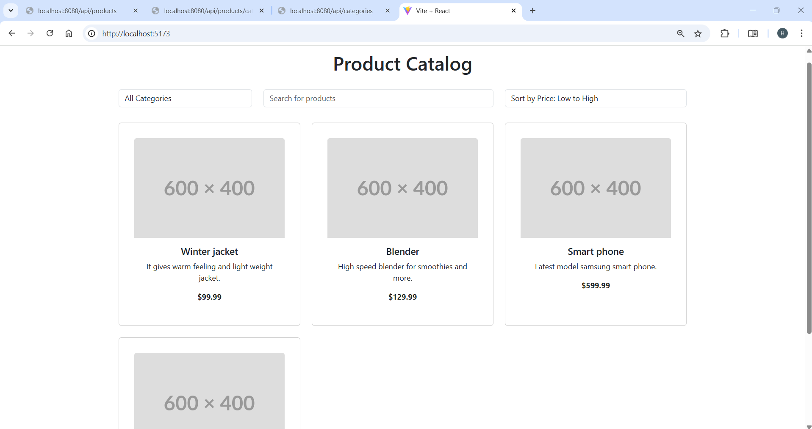
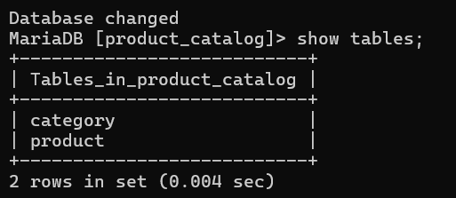

# E-commerce SpringBoot Project

This is a simple E-commerce application built with **Spring Boot**. The project comprises a front-end product catalog and a back-end database for managing products.

---

## Features
- **User-friendly Product Catalog**: A dynamic catalog of products with images, descriptions, and prices.
- **Product Details Page**: Open any product from the catalog to see its full information - name, description, image, price and category - before purchasing. The page is served by the React front-end and backed by the `GET /api/products/{id}` endpoint.
- **Back-End Database**: A robust database to manage product inventory and categories.
- **RESTful API**: A Spring Boot-based API to interact with the front-end and handle business logic.
  
---

## Screenshots

### Product Catalog Website
Below is a screenshot of the developed **E-commerce Website** showcasing the product catalog:



---

### Back-End Database
This screenshot shows the **Back-End Database** structure that supports the application, managing product data and user orders:



---

## API Documentation

The **E-commerce SpringBoot** project provides a set of RESTful API endpoints to manage products and orders. Below is a table that outlines the key API endpoints:

### API Endpoints Table
Here is an image of the API table showing the various endpoints:


The table above shows the various API methods, URL paths, request/response formats, and descriptions.

### Product Endpoints

| Method | Path | Description |
|--------|------|-------------|
| GET | `/api/products` | Returns the full list of products. |
| GET | `/api/products/{id}` | Returns a single product with its full details (`id`, `name`, `description`, `imageUrl`, `price`, `category`). |
| GET | `/api/products/category/{categoryId}` | Returns the products belonging to a category. |
| GET | `/api/categories` | Returns the list of categories. |

#### GET /api/products/{id}

Used by the product details page to load full information for one product.

```bash
curl http://localhost:8080/api/products/1
```

```json
{
  "id": 1,
  "name": "Wireless Mouse",
  "description": "Ergonomic wireless mouse with USB receiver",
  "imageUrl": "https://example.com/mouse.png",
  "price": 25.99,
  "category": { "id": 1, "name": "Electronics" }
}
```

Responses:

| Status | When | Body |
|--------|------|------|
| `200 OK` | A product with that id exists. | The product as JSON, including its category. |
| `404 Not Found` | The id is a well-formed number but no product has it (e.g. `999999`, `0`, `-1`). | Default Spring Boot error JSON (`timestamp`, `status`, `error`, `message`, `path`) with the message `Product not found with id <id>`. |
| `400 Bad Request` | The id is not a number or is outside the `Long` range (e.g. `abc`). | Default Spring Boot error JSON with the type-conversion message. |

Error bodies carry a `message` field because `server.error.include-message=always` is set in
`src/main/resources/application.properties`. This applies to every endpoint of the application and is
intended for local development only.

---

## Technologies Used
- **Backend**: Spring Boot, Java
- **Frontend**: React and Vite
- **Database**: MySQL
- **Other Tools**: Spring Data JPA, Hibernate

---

## How to Run

No Docker is required - the back-end uses an in-memory H2 database seeded at startup, and the
front-end runs on the Vite dev server. Prerequisites: JDK 21 and Node.js 18+.

1. Clone the repository:
   ```bash
   git clone https://github.com/Harishanan/E-commerce-SpringBoot.git

2. Navigate to the back-end module:
   ```bash
   cd ecom-project

3. Run the application (use `mvnw.cmd` on Windows):
   ```bash
   ./mvnw spring-boot:run

4. Call the API:
   ```bash
   http://localhost:8080/api/products
   http://localhost:8080/api/products/1

5. In a second terminal, start the front-end:
   ```bash
   cd ecom-front/ecom-catalog-react
   npm install
   npm run dev

6. Open the catalog in your browser and click a product to see its details page:
   ```bash
   http://localhost:5173

The front-end expects the back-end on `http://localhost:8080`; the back-end allows the
`http://localhost:5173` origin via CORS.

---

## Running the Tests

Back-end (JUnit 5 + Spring Boot Test, with a JaCoCo coverage report):

```bash
cd ecom-project
./mvnw clean test
```

The coverage report is written to `ecom-project/target/site/jacoco/index.html`.

Front-end unit tests (Vitest) and end-to-end tests (Playwright):

```bash
cd ecom-front/ecom-catalog-react
npm test
npm run test:e2e
```

---

## License
This project is licensed under the MIT License - see the LICENSE file for details.


